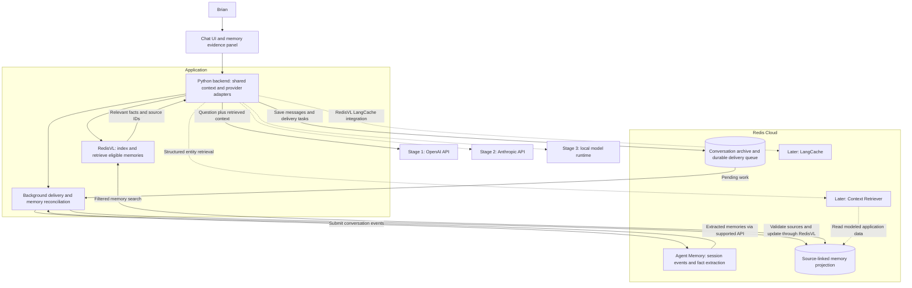
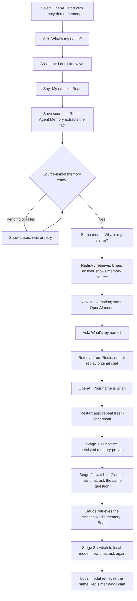

# Redis shared context demo — diagrams

Based on PRD v0.5. These diagrams describe the planned OpenAI-first implementation, not deployed infrastructure.

## 1. Architecture

Solid connections show the first milestone. Dashed connections show later additions. RedisVL is an application library; Agent Memory, Context Retriever, and LangCache are managed services.

All answering providers return their generated answer to the backend, which saves it and displays it in the UI; response arrows are omitted for clarity. Provider keys remain server-side. Embedding configuration for the RedisVL projection is independent of the answering model; Agent Memory has its own managed processing configuration.

The name-recall demo bypasses LangCache. Context Retriever and LangCache are added after the three provider milestones. They are not prerequisites for the first working demonstration.

## 2. User flow

A fresh conversation retains the same opaque user identity but does not resend the original conversation or a provider-side conversation chain. This is what proves Redis-backed recall.

The application must not seed Brian's name through account metadata, the user ID, or a hardcoded prompt. Before the memory exists, the baseline answer should not know the name. Every successful recall shows the actual retrieved memory and its source. Switching answering models does not require migrating memories or changing their embeddings.
